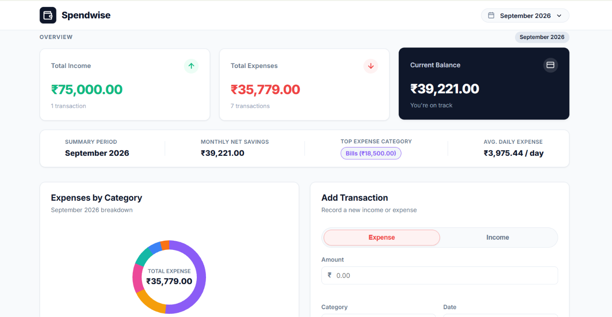
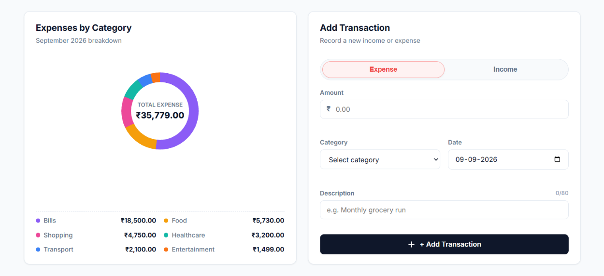
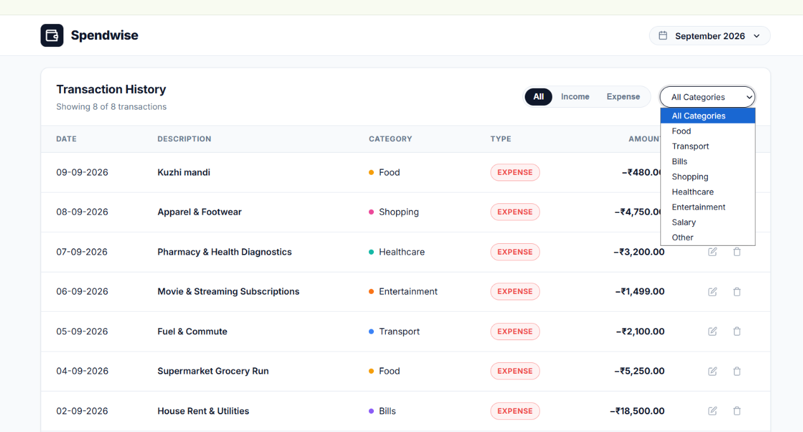

# Spendwise — Personal Finance & Expense Tracker

**Spendwise** is a modern, responsive personal finance and expense tracking web application built entirely with **Vanilla HTML5, CSS3, and JavaScript (ES6)**. It runs directly by opening `index.html` in any web browser without needing a build step, Node.js, or external frameworks.

## 📸 Screenshots







---

## 🌟 Key Features

- **🛡️ Strict Form Validation & Helpful Error Messages**:
  - **Inline Red Helper Text**: Detailed error messaging under each input field (`Amount > ₹0.00 & ≤ ₹1 Crore`, `Category required`, `Valid Date (2000-2099)`, `Description 1-80 chars`).
  - **Form Error Alert Banner**: Shaking red alert banner summarizing active field errors when submission fails.
  - **Real-Time Input Validation**: Instantly clears error states as the user types or selects valid inputs.
  - **Character Counter**: Live indicator (`0/80`) for description input length.
  - **Floating Toast Notifications**: Elegant green/blue success & alert toasts for Add, Edit, and Delete actions.
  - **Zero `alert()` Popups**: Pure inline DOM messaging.

- **🗓️ Month Selector & Dedicated Monthly Expense Summary**:
  - Dynamically populates all available months in your financial history (e.g. `September 2026`, `August 2026`, or `All Time Overview`).
  - Dedicated **Monthly Expense Summary Banner** displaying:
    - **Monthly Net Savings** (`Income − Expenses`)
    - **Top Expense Category of the Month** (with category color badge & amount)
    - **Avg. Daily Expense** (`₹X / day`)

- **📊 Dynamic Overview Cards**:
  - Real-time recalculations for **Total Income**, **Total Expenses**, and **Current Balance** synced to your selected month.
  - Dynamic status indicator ("You're on track" vs "Expenses exceed income").

- **🍩 Pure SVG Donut Chart**:
  - Interactive expense distribution ring chart for the selected period.
  - Category breakdown with custom color tokens (Bills, Entertainment, Food, Healthcare, Shopping, Transport, Salary, Other).
  - Hover on chart segments to inspect category totals in the center of the ring.

- **✏️ Complete CRUD Operations**:
  - **Add Transactions**: Toggle between Expense and Income, select categories, pick dates, and add descriptions.
  - **Edit Transactions**: Populates the form with existing record data, allows smooth inline editing and saving.
  - **Delete Transactions**: Confirmation prompt before removing records immediately.

- **⚡ Combinable Live Filtering**:
  - Filter transactions by **Month**, **Type** (`All`, `Income`, `Expense`), and **Category**.
  - Live count indicator updating dynamically (e.g., "Showing 7 of 7 transactions").

- **🇮🇳 Indian Currency Formatting**:
  - All financial values formatted using standard Indian numbering system (`₹` prefix, commas, 2 decimal places e.g., `₹5,250.00`).

- **💾 LocalStorage Persistence**:
  - All transactions persist across browser refreshes. Pre-populated realistic sample data on first run.

- **📱 Fully Responsive Design**:
  - Desktop 2-column main grid seamlessly collapses to 1-column on mobile viewports.
  - History table transforms into stacked mobile card views for touch screens.

---

## 🚀 How to Run the App

No installation or node modules are required!

1. Open the project folder on your computer.
2. Double-click **`index.html`** or right-click and choose **"Open with Chrome / Edge / Safari / Firefox"**.
3. Enjoy tracking your expenses!

## 💻 Run on Another Device

You can run Spendwise on another computer without installing Node.js or any dependencies.

### Option 1: Download from GitHub

1. Open the [Spendwise GitHub repository](https://github.com/Athul-V-Pillai/expense-tracker--athul_v_pillai-).
2. Select **Code → Download ZIP**.
3. Extract the ZIP file on the other device.
4. Open the extracted folder and double-click **`index.html`**.

### Option 2: Clone with Git

If Git is installed, run:

```bash
git clone https://github.com/Athul-V-Pillai/expense-tracker--athul_v_pillai-.git
```

Then open the cloned folder and double-click **`index.html`**.

Transactions are saved in the browser's local storage, so data created on one device will not automatically appear on another device.

---

## 📁 Project Structure

```
Spendwise/
├── index.html     # Semantic HTML5 markup & UI components
├── style.css      # CSS Design system, responsive grid & mobile media queries
├── script.js      # State management, math, validation & storage engine
└── README.md      # Application documentation & features
```
